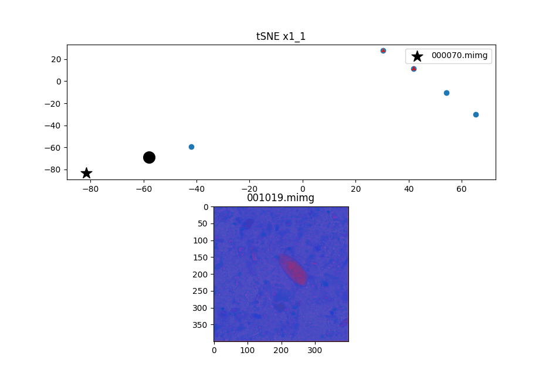

# GT-Free Image Selection


Demo code for article "Interactive Ground-Truth-Free Image Selection for FLIM Segmentation Encoders"

This particular demo shows how to select a new image given a model and [few images](/data/) as example


## Running example

To run our demo is necessary to download a docker image and runs the interactive src file


### Download docker images

To run the docker image runs 

```
docker pull gtfree_image_selection

```

now run this particular image with all video permitions:

`
docker run --rm -it -d --gpus=all --ipc=host -p 9990:9990 --env="DISPLAY" --name gtfree1 -e DISPLAY=unix$DISPLAY -e XAUTHORITY=$XAUTHORITY -e XDG_RUNTIME_DIR=$XDG_RUNTIME_DIR --shm-size=10g --net=host gtfree_image_selection /bin/bash
`

`
docker exec -it gtfree1 bash
`

`
docker cp GTFreeImageSelection gtfree1:/app/
`

and runs the script:

```
cd GTFreeImageSelection
python3 src/interative.py
```

the interface will show the following interaction:



